# Comparative Study of Mobile Technologies: Flutter, React Native, Swift

## 1. Introduction
As part of our mobile project, we evaluated three modern technologies: **Flutter** (Dart), **React Native** (JavaScript/TypeScript), and **Swift** (native for iOS). The goal was to select the technology best suited to our needs in terms of:

- **Performance**
- **User Experience (UX/UI)**
- **Ease of Development**
- **Ecosystem and Tools**
- **Maintenance and Scalability**

### Summary of the Decision
After an in-depth analysis, **Flutter** was chosen for its **cross-platform performance, UI/UX flexibility, and rapid development capabilities**. This document provides a detailed comparison of the three technologies and justifies our decision.

---

## 2. Technology Comparison

### 2.1 Evaluation Criteria

| Criterion                | **Flutter**       | **React Native**      | **Swift**            |
|--------------------------|-------------------|-----------------------|----------------------|
| **Language**             | Dart             | JavaScript/TypeScript | Swift (iOS native)   |
| **Performance**          | Excellent        | Moderate to Good      | Excellent (native)   |
| **User Experience (UI/UX)** | Very Good       | Good                 | Exceptional (native) |
| **Ease of Development**  | Very Good        | Good                 | Moderate             |
| **Ecosystem and Tools**  | Rich             | Rich                 | Limited (iOS only)   |
| **Maintenance and Scalability** | Very Good   | Good                 | Moderate             |
| **Cross-Platform Support** | Yes             | Yes                  | No                   |

### 2.2 Strengths and Weaknesses of Each Technology

#### **Flutter**
##### Compilation

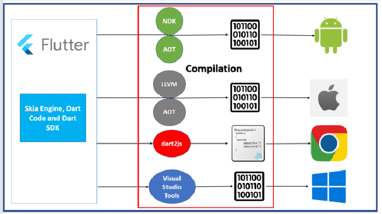

- **Strengths**:
  - Near-native performance thanks to the **Skia** rendering engine.
  - UI flexibility: Customizable widgets allow complete control over design.
  - Single codebase for Android and iOS, reducing development and maintenance costs.
  - Rich ecosystem (package manager, extensive documentation).
  - Rapid development with **Hot Reload**.

- **Weaknesses**:
  - Slightly larger application sizes compared to native solutions.
  - Fewer experienced developers available compared to React Native or Swift.
  - Requires knowledge of Dart, a language less popular than JavaScript or Swift.

#### **React Native**
##### Compilation

- **Strengths**:
  - Large community and extensive support due to JavaScript usage.
  - Access to numerous third-party libraries.
  - Cross-platform support with a single codebase for Android and iOS.

- **Weaknesses**:
  - Lower performance compared to Flutter or Swift in complex applications (issues with JavaScript-native bridging).
  - Sometimes challenging dependency and version management.
  - Slightly inferior user experience compared to native solutions.

#### **Swift**
##### Compilation

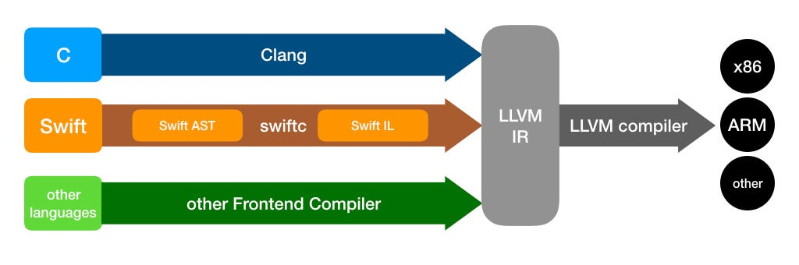

- **Strengths**:
  - Optimal performance and direct access to iOS native APIs.
  - Fully leverages iOS-specific features.
  - Exceptional user experience with complete control over the interface.

- **Weaknesses**:
  - Development limited to iOS (no cross-platform support).
  - Higher development costs if an Android version is also required.
  - Steeper learning curve for developers unfamiliar with Swift.

---

## 3. Justification for Choosing Flutter

### 3.1 Performance
- **Flutter** outperforms React Native thanks to its Skia graphics engine, which eliminates JavaScript-native bridges and provides smooth animations.
- While Swift offers unmatched native performance, Flutter is fast enough to ensure an excellent user experience on both platforms.

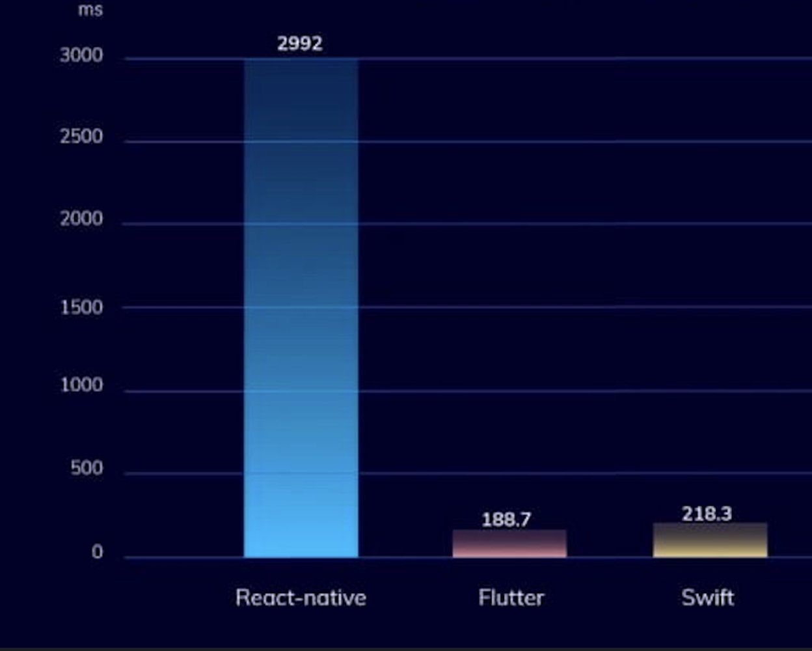

With a big surprise flutter seem to be the best techno to handle massive calculation test for the CPU compared to react far behind.

### 3.2 User Experience (UI/UX)
- **Flutter widgets** allow full control over the user interface, enabling highly customized designs without relying on native components.
- React Native is limited by its hybrid approach, while Swift is optimal but constrained to iOS only.

Swift is the reference in term of component because they its the native language backed by Apple so lets see how close the component are between the 2 framework Flutter & React-native:

In order to develop the area project i need to use the modal bottom sheet component from Apple to list all the APis here how it should look:

Swift (reference)         |  React-native       |   Flutter
:-------------------------:|:-------------------------:|:-------------------------:
||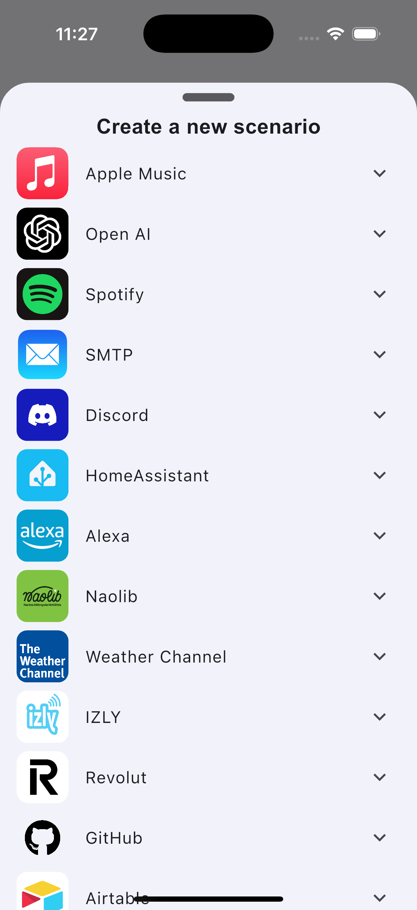|

As we can see both modal sheet look quite the same but the animation of background black filter with opacity is less smooth than flutter when opening the modal

### 3.3 Ease of Development
- **Hot Reload** in Flutter significantly speeds up the development cycle, a major advantage over Swift.
- A single codebase requirement (versus two with Swift) reduces development time compared to native solutions.

### 3.4 Ecosystem and Tools
- Flutter offers a rich ecosystem with well-documented packages and tools like **Flutter DevTools** for debugging.
- React Native benefits from JavaScript's popularity, but its libraries are sometimes less well-maintained.
- Swift is limited to the iOS ecosystem, making it less attractive for cross-platform applications.

### 3.5 Maintenance and Scalability
- Flutter simplifies maintenance through its unified codebase.
- React Native, while scalable, can face compatibility issues with libraries.
- Swift requires independent maintenance for each platform, increasing costs.

### 3.6 Time to launch the app

Flutter         |  React-native       |   Swift
:-------------------------:|:-------------------------:|:-------------------------:
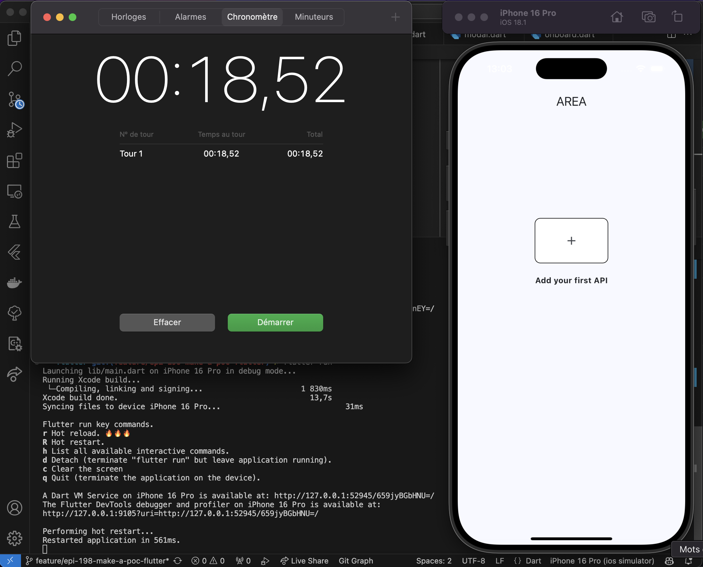|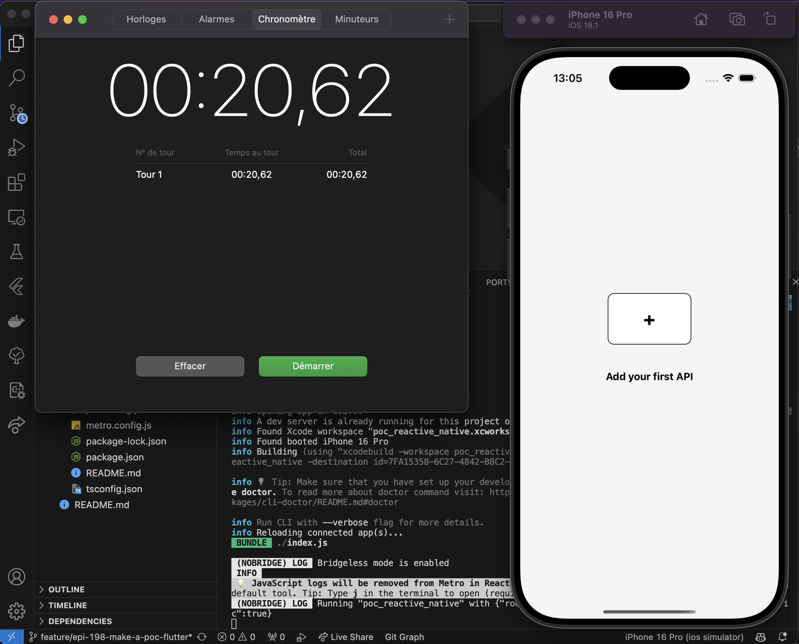|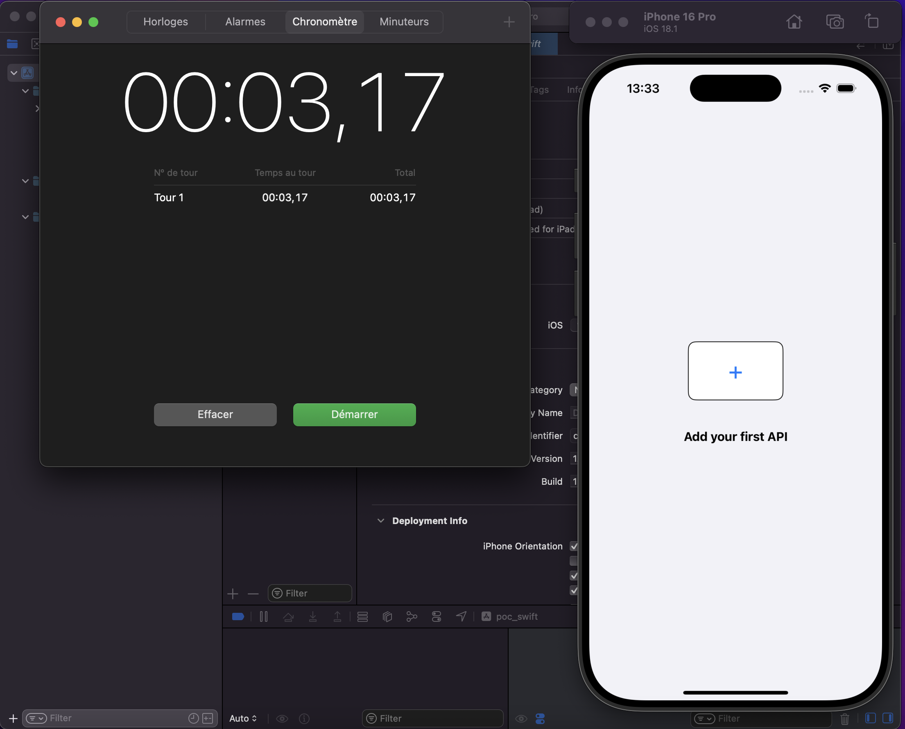|

### Community and Ecosystem

---

## 4. Conclusion

### Why Flutter?
- **High-performance cross-platform support**: Flutter ensures near-native performance on Android and iOS with a single codebase.

comparative of performance when scroll through a list view (frame, heap...)
| Android                                                                 | iOS                                                                    |
|------------------------------------------------------------------------|------------------------------------------------------------------------|
| 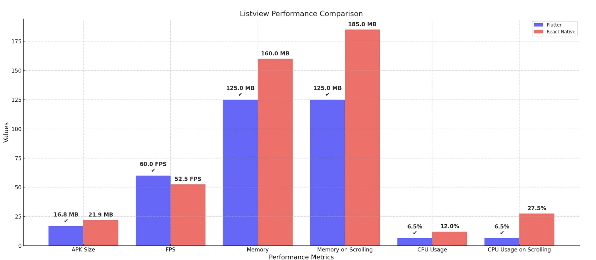 | 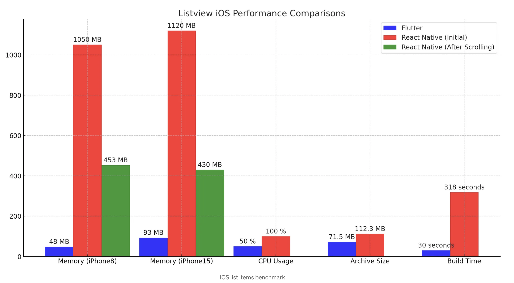 |

comparative of performance when add animation (usefull when we will create node to link action-reaction boxes together as Github action)
| Android                                                                 | iOS                                                                    |
|------------------------------------------------------------------------|------------------------------------------------------------------------|
| 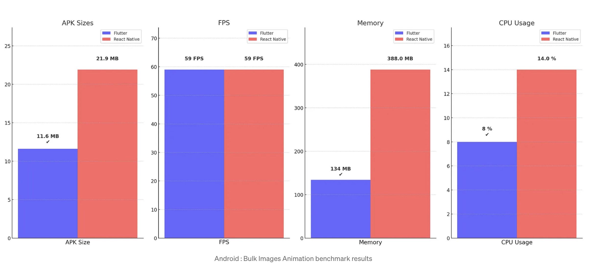 | 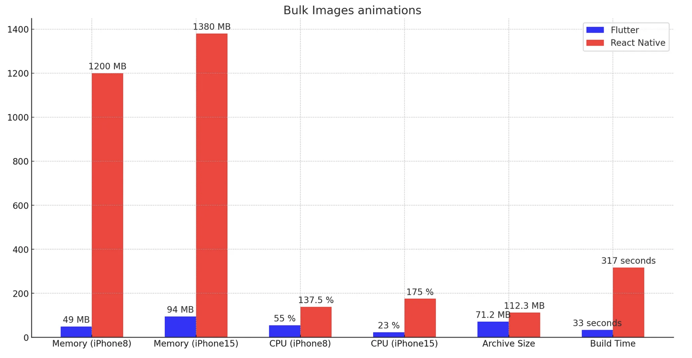 |

---

- **UI/UX flexibility**: Flutter allows modern, highly customized user interfaces.
- **Fast and efficient development**: Hot Reload and a rich ecosystem make development seamless.
- **Reduced costs**: A single codebase cuts down development and maintenance expenses.

### Accepted Limitations
- Slightly larger app sizes.
- The need to train or hire developers proficient in Dart.

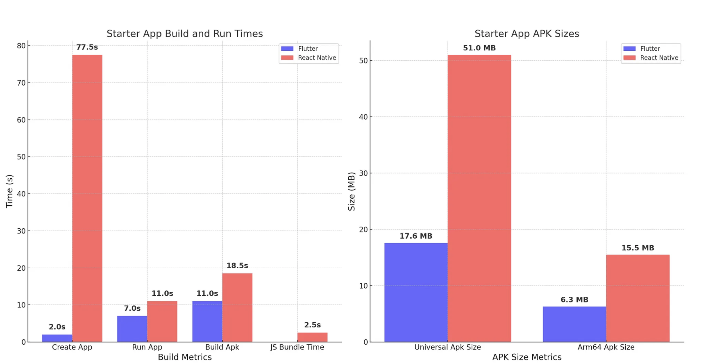

### Final Decision
**Flutter was chosen as the primary technology for our mobile application, offering the ideal balance between performance, flexibility, and cross-platform efficiency.**
