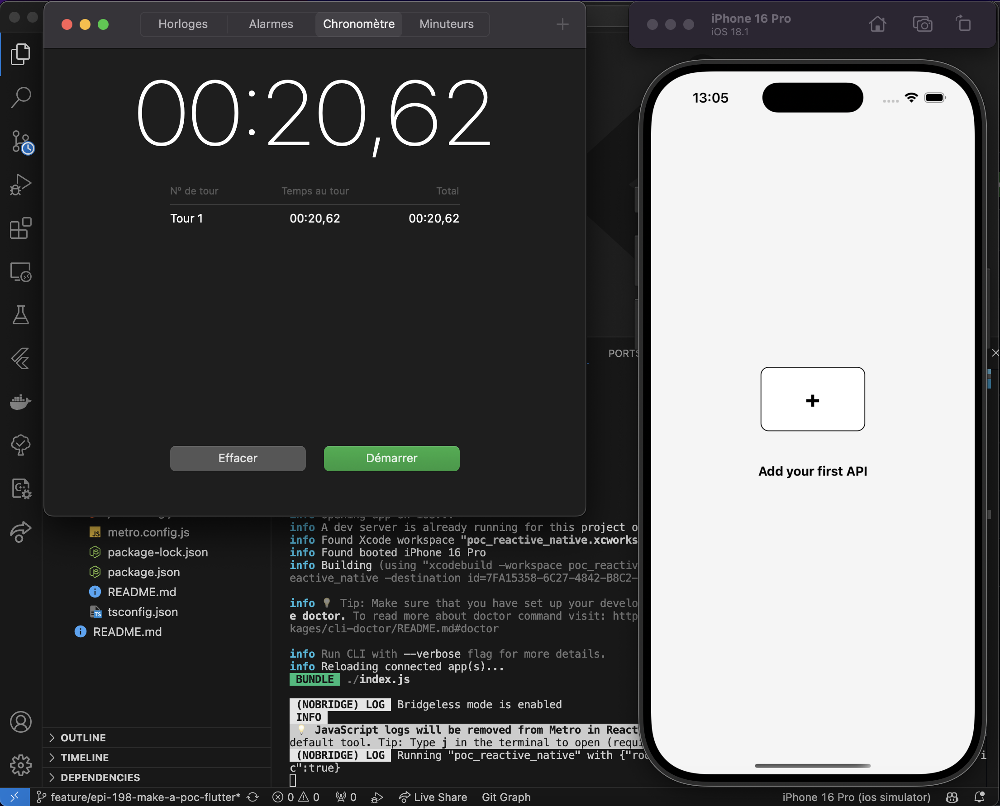
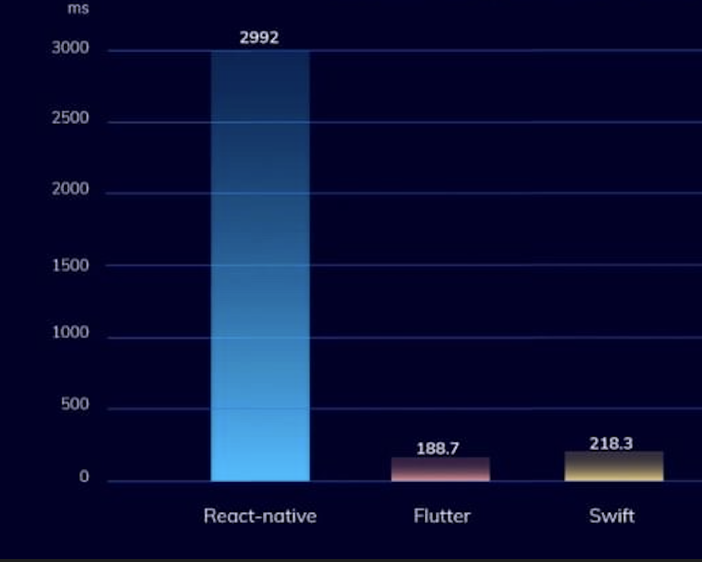

# Comparative Study

This comparative study is based on my own experience after developping 3 PoC in order to develop the area project. Through this comparative we are gonna compare 3 technologies: Swift, React-Native and flutter.

## Time to launch the app

Flutter         |  React-native       |   Swift
:-------------------------:|:-------------------------:|:-------------------------:
|||

As we can see Swift is clearly the fastest to run from 0 an app like the area menu, Flutter is in top 2 and then no longer after React native 20,62s to build the project.

We can note that Swift is the only language that not provide a hot reload tool whitch mean you have to re-run the app everytime you edit something while flutter is almost realtime and react took few millisecond more to reload the UI.

## CPU intensive test for factorial

With a big surprise flutter seem to be the best techno to handle massive calculation test for the CPU compared to react far behind.

## Component

Swift is the reference in term of component because they its the native language backed by Apple so lets see how close the component are between the 2 framework Flutter & React-native:

In order to develop the area project i need to use the modal bottom sheet component from Apple to list all the APis here how it should look:

Swift (reference)         |  React-native       |   Flutter
:-------------------------:|:-------------------------:|:-------------------------:
|||

As we can see both modal sheet look quite the same but the animation of background black filter with opacity is less smooth than flutter when opening the modal